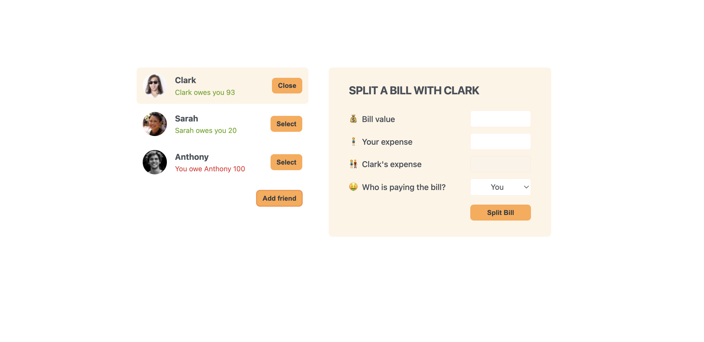

# Eat-n-Split

Eat-n-Split is a simple React application that helps you manage and split bills among friends. You can add friends, select a friend, and split the bill with them, updating their balance accordingly.



## Features

- Add new friends with a name and image.
- Select a friend to split the bill with.
- Update the balance of the selected friend based on the bill split.

## Technologies Used

- **React**: A JavaScript library for building user interfaces.
- **useState Hook**: To manage the state of the application, including friends list, selected friend, and visibility of the add friend form.
- **Component-based Architecture**: The application is divided into reusable components such as `AddFriendForm`, `Button`, `FriendsList`, and `SplitBillForm`.

## Components

- **App**: The main component that holds the state and renders other components.
- **AddFriendForm**: A form to add a new friend.
- **Button**: A reusable button component.
- **FriendsList**: A list of friends that allows selection.
- **SplitBillForm**: A form to split the bill with the selected friend.

## How to Run

1. Clone the repository.
2. Navigate to the project directory.
3. Install dependencies using `npm install`.
4. Start the development server using `npm start`.

## Skills Demonstrated

- **State Management**: Using the `useState` hook to manage the state of friends, selected friend, and form visibility.
- **Conditional Rendering**: Rendering components conditionally based on the state.
- **Event Handling**: Handling events such as form submission and button clicks.
- **Component Communication**: Passing data and functions between parent and child components via props.

## Getting Started

To get started with the project, follow these steps:

1. Clone the repository:
   ```bash
   git clone https://github.com/your-username/eat-n-split.git
   ```
